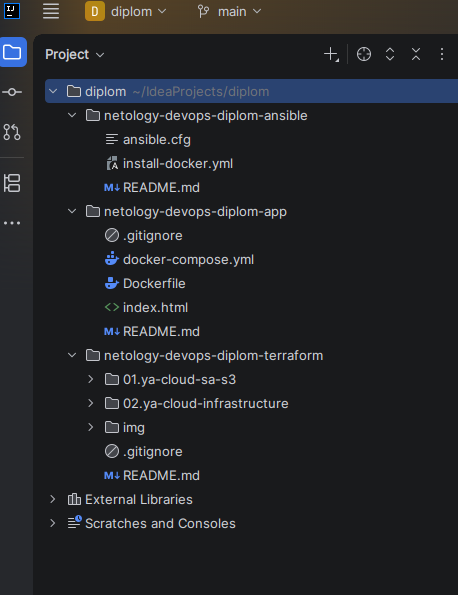
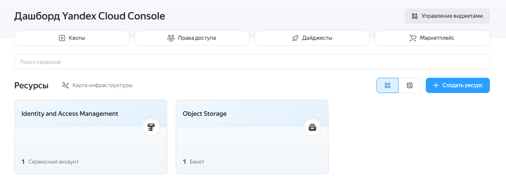
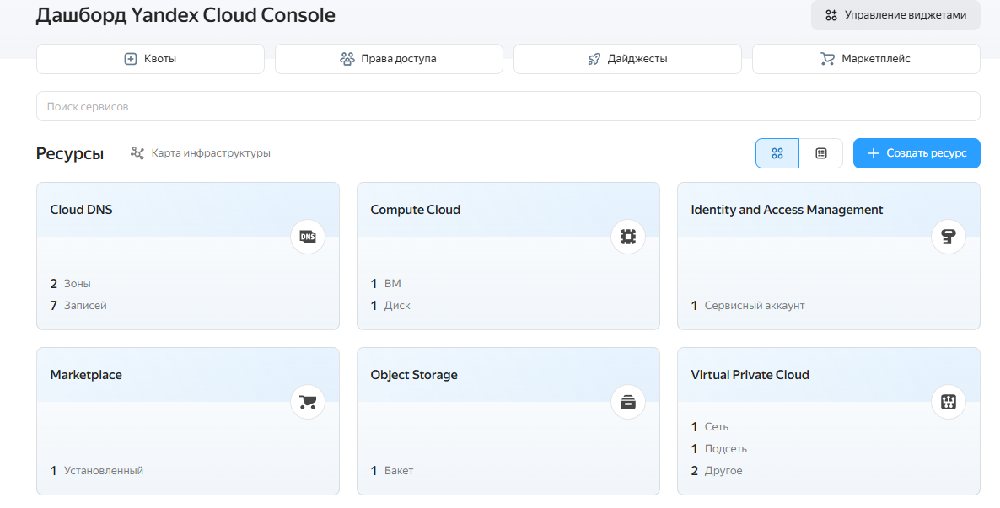
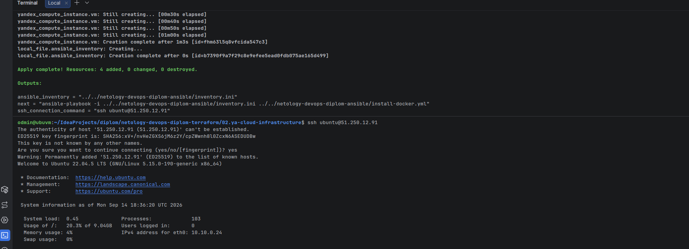
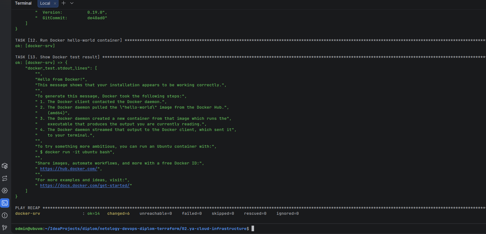
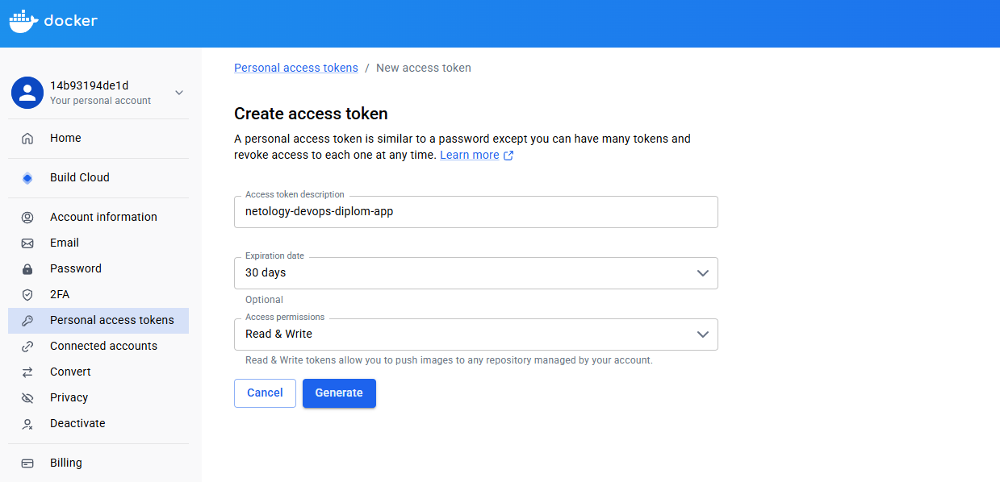
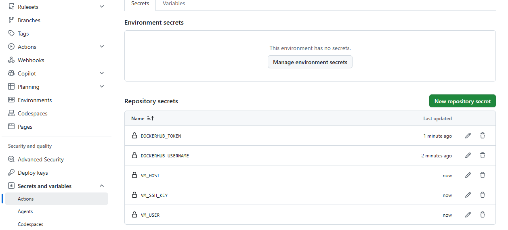
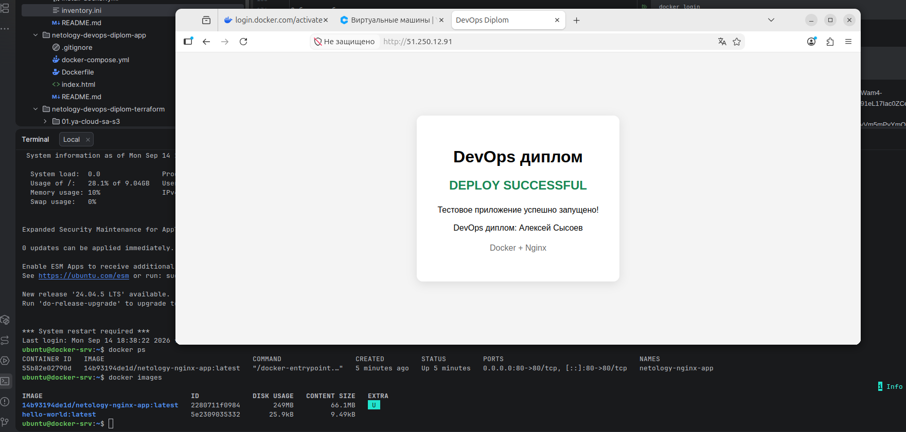
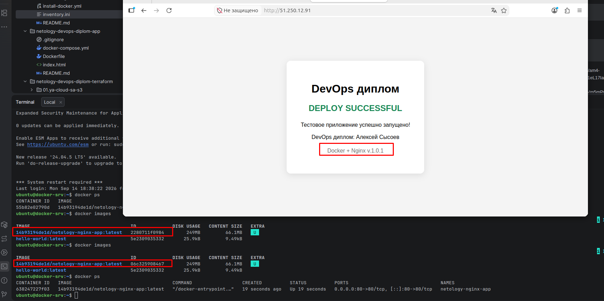

### Итоговый проект курса «DevOps-инженер с нуля»

#### Тема итоговой работы - Базовая DevOps‑инфраструктура в Yandex.Cloud

---
#### Цели:
- развернуть базовую облачную инфраструктуру и подготовить виртуальную машину к работе приложения;
- развернуть контейнерное веб‑приложение в Yandex.Cloud, опубликовать Docker‑образ в реестре и настроить автоматическое обновление приложения при изменении кода;
- продемонстрировать понимание ключевых практик DevOps: инфраструктура как код, контейнеризация и базовый CI/CD‑pipeline;
- оформить проект в виде понятной документации, чтобы другой специалист смог воспроизвести ваше решение по инструкции.

---
#### Используемое окружение:
OS: Ubuntu 26.04 LTS (Resolute Raccoon)

Перед началом выполнения установлено:
- [git](https://git-scm.com/install/linux);
- [docker](https://docs.docker.com/engine/install/ubuntu/);
- [terraform](https://developer.hashicorp.com/terraform/install);
- [ansible](https://docs.ansible.com/projects/ansible/latest/installation_guide/installation_distros.html);
- сгенерирован ~/.ssh/id_ed25519.pub;
- [yc cli](https://yandex.cloud/ru/docs/cli/operations/install-cli);
- в Yandex Cloud Console созданы `cloud_id` и `folder_id`.

Структура каталогов проекта:  


---
#### Этапы выполнения:
#### 1. Подготовка облачной инфраструктуры
Создание облачной инфраструктуры разделено на 2 проекта:  
##### 1.1. Проект в каталоге [01.ya-cloud-sa-s3](./01.ya-cloud-sa-s3/main.tf)  
создаёт сервисный аккаунт, `authorized_key.json`, файл `s3.env` с ключами доступа к бакету и сам бакет. Для запуска проекта `01.ya-cloud-sa-s3` необходимо создать файл `terraform.tfvars` и заполнить своими значениями. Пример содержимого:
```
cloud_id        = "b1g***"
folder_id       = "b1g***"
zone            = "ru-central1-a"
service_account = "netology-sa-var"
bucket_name     = "storage-bucket-netology-diplom-var"
```  
Получаем IAM-токен с помощью YC.  
**Выполняемые команды:**  
```bash
yc iam create-token
```
Инициализируем проект и запускаем первый шаг по настройке инфраструктуры:
```bash
terraform init
terraform plan
terraform apply
```
**Итогом выполнения команд** является создание сервисного аккаунта и бакета в Yandex Cloud. Скриншот:  


#### 1.2. Проект в каталоге [02.ya-cloud-infrastructure](./02.ya-cloud-infrastructure/backend.tf)  
через созданный файл `authorized_key.json` создаёт инфраструктуру из VPC, подсети и виртуальной машины. Для запуска проекта `02.ya-cloud-infrastructure` необходимо создать файл `terraform.tfvars` и заполнить своими значениями. Пример содержимого:
```
cloud_id                 = "b1g"
folder_id                = "b1g***"
zone                     = "ru-central1-a"
service_account_key_file = "../authorized_key.json"
ssh_public_key_path      = "~/.ssh/id_ed25519.pub"
ssh_user                 = "ubuntu"
```
Загружаем переменные из файла `s3.env` в текущую Bash-сессию.  
**Выполняемые команды:**  
```bash
source ../s3.env
```
Инициализируем проект и запускаем второй шаг по настройке инфраструктуры:
```bash
terraform init -backend-config="bucket=$BUCKET_NAME"
terraform plan
terraform apply
```
**Итогом выполнения команд** является создание VPC, подсети и VM в Yandex Cloud. Файла `inventory.ini` для дальнейшего запуска Ansible. Скриншот:  
  


---
##### 2. Установка Docker на виртуальной машине
Для установки Docker используется [Ansible‑playbook](https://github.com/1000karat/netology-devops-diplom-ansible/blob/main/install-docker.yml) из репозитория [netology-devops-diplom-ansible](https://github.com/1000karat/netology-devops-diplom-ansible).  
**Выполняемые команды:**
```bash
ansible-playbook -i ../../netology-devops-diplom-ansible/inventory.ini ../../netology-devops-diplom-ansible/install-docker.yml
```
**Итогом выполнения команды** является установленный Docker. Скриншот:  


---
#### 3. Подготовка тестового приложения  
Тестовое приложение находится в репозитори [netology-devops-diplom-app](https://github.com/1000karat/netology-devops-diplom-app)  
- [Dockerfile](https://github.com/1000karat/netology-devops-diplom-app/blob/main/Dockerfile)  
- [compose.yaml](https://github.com/1000karat/netology-devops-diplom-app/blob/main/docker-compose.yml)

Для локальной сборки образа и его запуска **выполняются команды:**
```bash
docker build -t 14b93194de1d/netology-nginx-app:1.0.0 .
docker run -d --rm -p 80:80 --name netology-nginx-app 14b93194de1d/netology-nginx-app:1.0.0
```
**Итогом выполнения команд** является запуск локального nginx.

---
#### 4. Публикация образа в реестре  
Для публикации приложения был выбран https://hub.docker.com  
**Выполняемые команды:**
```bash
docker login
docker push 14b93194de1d/netology-nginx-app:1.0.0
```
**Итогом выполнения команд** является загрузка приложения в репозиторий по ссылке [hub.docker.com](https://hub.docker.com/r/14b93194de1d/netology-nginx-app)

---
#### 5. Настройка CI/CD  
#### 5.1. Подготовка SSH ключей для GitHub Actions и VM  
Для взаимодействия между GitHub Actions и VM создаётся SSH ключ. **Выполняемые команды:**   
```bash
ssh-keygen -t ed25519 -C "github-actions" -f ~/.ssh/github_actions
```
Отправить публичный ключ на VM:
```bash
ssh-copy-id -i ~/.ssh/github_actions.pub ubuntu@ip_address
```

#### 5.2. Создание token в docker для GitHub Actions  
Для отправки образа в реестр создаётся токен в docker hub. В дальнейшем записывается в значение `DOCKERHUB_TOKEN`. Скриншот:  
  

#### 5.3. Настройка `Secrets` в GitHub.com  
В репозитории переходим по пути `Settings` -> `Secrets and variables` -> `Actions` -> `New repository secret` и создаём секреты:
| Secret             | Value                                                                                                                                                                                                                                                                                |
|--------------------|--------------------------------------------------------------------------------------------------------------------------------------------------------------------------------------------------------------------------------------------------------------------------------------|
| DOCKERHUB_USERNAME | username hub.docker.com                                                                                                                                                                                                                                                              |
| DOCKERHUB_TOKEN    | в настройка docker [профиля](https://app.docker.com/) во вкладке "Personal access tokens" нажимаем "Generate new token" и выполняем генерацию нового token с правами "Read & Write". Полученный personal access token вставляем в значение для Repository secrets "DOCKERHUB_TOKEN". |
| VM_USER            | ранее прописанное значение в файле `02.ya-cloud-infrastructure/terraform.tfvars`. По умолчанию - `ubuntu`.                                                                                                                                                                           |
| VM_HOST            | заполнить ip адрес из файла `netology-devops-diplom-ansible/inventory.ini`.|
| VM_SSH_KEY         | cat ~/.ssh/github_actions |

Скриншот:  
  


#### 5.3. Настройка `Actions` в GitHub.com  
В репозитории переходим в `Actions` выбираем "Docker image Build a Docker image to deploy, run, or push to a registry" и жмём "Configure".
Заполняем имя файла docker-image.yml с [содержимым](https://github.com/1000karat/netology-devops-diplom-app/blob/main/.github/workflows/docker-image.yml). Нажимаем `Commit changes...`. Скриншот выполнения:  
  


#### 5.4. Итоговая проверка 
Вносим изменения в `index.html`. Нажимаем `Commit changes...`. Скриншот выполнения:  
  


---
##### 6. Удаление инфраструктуры.
Команда `terraform destroy` выполняется из каталога [02.ya-cloud-infrastructure](./02.ya-cloud-infrastructure) 
